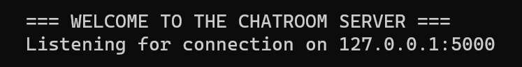
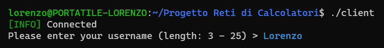
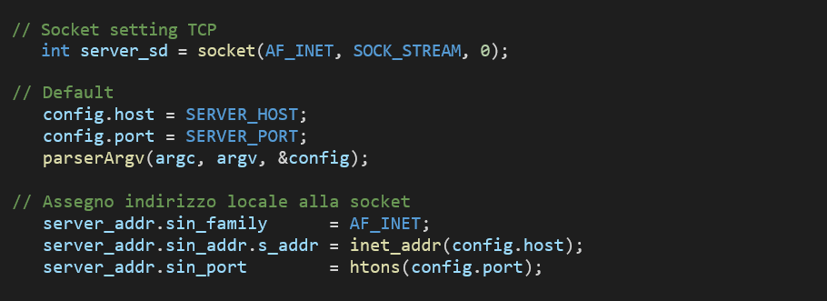
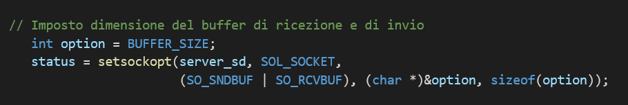

Progetto di Reti di Calcolatori

*Chatroom TCP client / server multi-thread*

Introduzione
============

Il progetto consiste nella creazione di un modello client server per
scambi di messaggi testuali tra più utenti in diverse stanze.

Client e server utilizzano socket TCP per comunicare tra loro.

Il server gestisce più client utilizzando un modello multi-thread
chiamando la subroutine *handleClient* in un thread separato.

Dopodiché si mette in ascolto per connessioni in entrata all'indirizzo e
porta specificati nelle opzioni, o su quelle di default.

Usage: server \[-?\] \[-h IP\] \[-p PORT\] \[\--host=IP\]
\[\--port=PORT\]

{width="5.905511811023622in"
height="0.7668908573928259in"} *Figura 1 -- server all'avvio*

Il client in multithread gestisce l'invio e la ricezione dei messaggi.

All'avvio del client l'utente tenta la connessione al server specificato
nelle opzioni.\
Se la connessione va a buon fine il server crea un utente con uid
univoco e username a scelta e lo inserisce nella stanza principale
"General".

Usage: client \[-?\] \[-d DOMAIN\] \[-h IP\] \[-p PORT\]

\[\--domain=DOMAIN\] \[\--host=IP\] \[\--port=PORT\]

{width="5.905511811023622in"
height="0.7422025371828521in"}

*Figura 2 -- client all'avvio*

Configurazione lato Server
==========================

Creazione socket
----------------

Il server crea una socket TCP e ci assegna l'interfaccia e la porta su
cui ascolterà.\
Di default indirizzo e porta vengono assegnati tramite delle define
*SERVER\_HOST* e *SERVER\_PORT* presenti in *"server.h"* altrimenti
vengono assegnati ai valori specificati come opzioni *---host* e
*---port* gestite dal parser tramite la funzione *parserArgv* definita
in *"parser.h".*

 

// Socket setting TCP

    int server\_sd = socket(AF\_INET, SOCK\_STREAM, 0);

   

 // Default

    config.host = SERVER\_HOST;

    config.port = SERVER\_PORT;

    parserArgv(argc, argv, &config);

 // Assegno indirizzo locale alla socket

    server\_addr.sin\_family      = AF\_INET;

    server\_addr.sin\_addr.s\_addr = inet\_addr(config.host);

    server\_addr.sin\_port        = htons(config.port);

Opzioni socket
--------------

Tramite *setsockopt* vengono settate le opzioni della socket per la
dimensione del buffer di invio *SO\_SNDBUF* e di ricezione *SO\_RCVBUF.*

 // Imposto dimensione del buffer di ricezione e di invio

    int option = BUFFER\_SIZE;

    status = setsockopt(server\_sd, SOL\_SOCKET,

                        (SO\_SNDBUF \| SO\_RCVBUF), (char \*)&option, sizeof(option));

Bind
----

Eseguo la *bind* della socket all'indirizzo e porta specificati e la
preparo ad accettare connessioni tramite *listen.*

// Bind

    if (bind(server\_sd, (struct sockaddr \*)&server\_addr, sizeof(server\_addr))\< 0) {

        perror(\"ERROR: Socket binding failed\");

        return EXIT\_FAILURE;

    }

// Listen

    if (listen(server\_sd, 10) \< 0) {

        perror(\"ERROR: Socket listening failed\");

        return EXIT\_FAILURE;

    }

Accept
------

*accept* aspetta una connessione su *server\_sd* e quando la riceve apre
una nuova socket, *client\_sd* e assegna a *client\_addr* l'indirizzo
del client che si sta connettendo.

socklen\_t clilen = sizeof(client\_addr);

       int
client\_sd = accept(server\_sd, (struct sockaddr \*)&client\_addr, &clilen);

       logInfo(\"Connection received from %s:%d\", \
inet\_ntoa(client\_addr.sin\_addr), client\_addr.sin\_port);

Handle Client
-------------

Il server crea un nuovo utente assegnandogli l'indirizzo della
connessione ricevuta e la socket corrispondente, dopodiché crea un nuovo
thread chiamando la funzione *handleClient* che si occupa della gestione
dei messaggi, interpreta i comandi e inoltra i messaggi agli utenti
interessati.

 

// Crea un utente

    user\_t \*user = createUser(client\_addr, client\_sd);

 // Lancio il thread per la gestione dell\'utente

    pthread\_create(&threadId, NULL, &handleClient, (void \*)user);

Configurazione lato Client
==========================

Creazione socket
----------------

Come nel server il client crea una socket TCP e ci assegna l'indirizzo e
la porta a cui dovrà connettersi. Di default indirizzo e porta vengono
assegnati tramite delle define *CONNECTION\_HOST* e *CONNECTION\_PORT*
presenti in *"client.h"* altrimenti vengono assegnati ai valori
specificati come opzioni *---host* ( o *---domain* che verrà tradotto in
un host tramite *resolveHostname* ) e *---port* gestite dal parser
tramite la funzione *parserArgv* definita in *"parser.h".*

    

// Socket setting TCP

    int client\_sd = socket(AF\_INET, SOCK\_STREAM, 0);

config.host = CONNECTION\_HOST;

    config.port = CONNECTION\_PORT;

    parserArgv(argc, argv, &config);

    

server\_addr.sin\_family      = AF\_INET;

    server\_addr.sin\_addr.s\_addr = inet\_addr(config.host);

    server\_addr.sin\_port        = htons(config.port);

Opzioni socket
--------------

Tramite *setsockopt* vengono settate le opzioni della socket per la
dimensione del buffer di invio *SO*\_*SNDBUF* e di ricezione
*SO*\_*RCVBUF*

 // Imposto dimensione del buffer di ricezione e di invio

    int option = BUFFER\_SIZE;

    status = setsockopt(client\_sd, SOL\_SOCKET,

                        (SO\_SNDBUF \| SO\_RCVBUF), (char \*)&option, sizeof(option));

Connect
-------

Il client apre una connessione verso il server.

// Connect to Server    

    if (connect(client\_sd, (struct sockaddr \*)&server\_addr, sizeof(server\_addr))
\< 0 )

    {

         logError(\"Connection\");

        perror(\"\");

        return EXIT\_FAILURE;

    }

Send
----

Il server si aspetta di ricevere un username per creare l'utente.
Tramite la funzione *getCurrentStdin* e con gli opportuni controlli di
lunghezza dell'input preleviamo l'username da *stdin* e con *send* lo
mandiamo al server

// Send username

    send(client\_sd, username, MAX\_USERNAME\_LENGTH + 1, 0);

Message Handler
---------------

il client lancia due thread diversi per l'invio e la ricezione dei
messaggi in modo da poter gestire messaggi in arrivo durante l'invio di
un messaggio. Il thread di ricezione termina solo se il client riceve 0
byte da una lettura, evento che succede solo se il server crasha o
chiude la socket del client.

Tramite una *pthread*\_*join* si attende la terminazione del thread di
ricezione, dopodiché si interrompe l'esecuzione del programma, l'utente
chiude la socket ed esce dal server.

 

// Lancia i thread di gestione dei messaggi

    pthread\_create(&send\_msg\_thread, NULL, &sendMessageHandler, (void \*)username);

    pthread\_create(&recv\_msg\_thread, NULL, &recvMessageHandler, (void \*)username);

 // Attende che il thread finisca

    pthread\_join(recv\_msg\_thread, NULL);

    logWarn(\"LOGOUT\");

    close(client\_sd);

Implementazione chat
====================

Room structure
--------------

All'avvio il server inizializza la lista delle stanze inserendo una
stanza "General" e un utente "Admin" come amministratore della stanza di
default.

roomList = initializeRoomList(roomList);

*roomList* è un nodo sentinella che contiene il numero di stanze
presenti nel server, due puntatori alla testa e alla coda della lista e
un *mutex* per consentire l'accesso alla lista delle stanze in mutua
esclusione tra i vari thread, per evitare race conditions.

typedef struct room\_list

{

    volatile unsigned int count;

    struct room\_s \*       head;

    struct room\_s \*       tail;

pthread\_mutex\_t       mutex;

} room\_list;

Dopo l'inizializzazione la testa della lista punterà alla stanza
"General" che verrà usata come stanza di default, inserita nella lista
con la funzione *addRoom*.

Ogni stanza ha un uid univoco, un nome, un proprietario (l'utente che
crea la stanza), una lista di utenti, il nome del file di log da cui
recuperare la cronologia dei messaggi (verrà inizializzato più avanti
come "(room-\>name).log" e puntatori alla stanza precedente e successiva
nella lista.

// Struttura della stanza

typedef struct room\_s

{

    uid\_t              uid;

    char               name\[25\];

    struct user\_s \*    owner;

    struct user\_list \* userList;

    char               log\_filename\[30\];

    struct room\_s \*    next;

    struct room\_s \*    prev;

} room\_t;

Alla creazione di una stanza la sua lista utenti viene inizializzata,
allocando memoria, tramite la funzione *initializeUserList*

newRoom-\>userList = initializeUserList(newRoom-\>userList);

User Structure
--------------

*user\_list* è un nodo sentinella che contiene il numero di utenti
presenti nella stanza, due puntatori alla testa e alla coda della lista
e un *mutex* per consentire l'accesso alla lista degli utenti della
stanza in mutua esclusione tra i vari thread, per evitare race
conditions.

typedef struct user\_list

{

    volatile unsigned int count;

    struct user\_s \*       head;

    struct user\_s \*       tail;

    pthread\_mutex\_t       mutex;

} user\_list;

Ogni utente un uid univoco, un username, un colore con cui verrà
visualizzato dagli altri utenti (inizializzato random tra una lista di
colori durante la creazione dell'utente), un socket file descriptor, una
struttura *sockaddr\_in* contenente l'indirizzo del client
corrispondente, un puntatore alla stanza a cui appartiene e puntatori
all'utente precedente e successivo nella lista.

typedef struct user\_s

{

    uid\_t              uid;

    char               \*username;

    char               \*color;

    int                sock\_fd;

    struct sockaddr\_in addr;

    struct room\_s \*    room;

    struct user\_s \*    next;

    struct user\_s \*    prev;

 

} user\_t;

Il server permette un certo numero di utenti, definito in
*MAX\_CLIENT\_COUNT*.

Alla connessione di un nuovo client, se il numero di utenti collegati o
che stanno tentando l'accesso supera *MAX\_CLIENT\_COUNT*, nega
l'accesso e chiude la socket.\
\
Il client, non ricevendo la conferma di connessione, saprà che il server
è pieno e terminerà l'esecuzione stampando un messaggio di errore.

{width="5.905511811023622in"
height="0.4612051618547682in"}*Figura 3 -- Tentativo di connessione
fallito per superamento limite utenti*

 waitingForConnection++;

// Controllo se posso accettare nuovi utenti nel server

    if ((getTotalUserCount(roomList) + waitingForConnection) \> MAX\_CLIENT\_COUNT)

      {

          logWarn(\"Max clients reached. Rejected connection from %s:%d\", 

inet\_ntoa(client\_addr.sin\_addr), client\_addr.sin\_port);

          waitingForConnection\--;

          close(client\_sd);

          continue;

      }

        

 // Manda conferma di connessione

    send(client\_sd, STR(TRUE), 2, 0);

All'accesso l'utente viene inserito nella stanza "*General*".

SendMessage
-----------

La funzione *sendMessage* prende in input una stringa e un utente e
tramite la funzione *send* presente in *"socket.h"* prova ad inviarlo al
socket file descriptor dell'utente.

// Manda un messaggio direttamente ad un utente

void sendMessage(char \*msg, user\_t \*user)

{

     if (send(user-\>sock\_fd, msg, strlen(msg), 0) \< 0) {

        logError(\"Couldn\'t send message \'%s\' to user %d - %s at ip %s:%d\",

                 msg,

                 user-\>uid, user-\>username,

                 inet\_ntoa(user-\>addr.sin\_addr),

                 user-\>addr.sin\_port);

        perror(\"\");

     }

}

SendBroadcastMessage
--------------------

La funzione *sendBroadcastMessage* chiama *sendMessage* su tutti gli
utenti della stanza dell'utente che invia il messaggio, tranne che a sé
stesso, e tramite *keepLog* salva il messaggio nel file di log della
stanza.

// Manda un messaggio a tutti gli utenti della stanza dell\'utente eccetto il mittente

void sendBroadcastMessage(char \*msg, user\_t \*user)

{

    room\_t \*room = user-\>room;

    pthread\_mutex\_lock(&room-\>userList-\>mutex);

    user\_t \*recipient;

    for (recipient = room-\>userList-\>head; recipient; recipient = recipient-\>next) {

        if (user-\>uid != recipient-\>uid)

            sendMessage(msg, recipient);

    }

    pthread\_mutex\_unlock(&room-\>userList-\>mutex);

    keepLog(msg, user);

}

Restore Log
-----------

Con il comando */restore* l'utente può ricevere dal server l'elenco di
tutti i messaggi mandati in quella stanza prima che vi entrasse.

// Salva i messaggi nel file di log della stanza

void keepLog(char \*msg, user\_t \*user) {

     FILE \*log\_fp = fopen(user-\>room-\>log\_filename, \"a+\"); 

     fprintf(log\_fp, \"%s\", msg);

     fclose(log\_fp);

}

// Ripristina la cronologia dei messaggi della stanza in cui è l\'utente

void restoreLog(user\_t \*user) {

    FILE \*log\_fd = fopen(user-\>room-\>log\_filename, \"r\");

    char  buffer\[BUFFER\_SIZE\];

    while (fgets(buffer, sizeof(buffer), log\_fd)) {

        sendMessage(buffer, user);

    }

}

Print Room List
---------------

Con il comando /rooms l'utente può stampare la lista di stanza
disponibili con i vari utenti connessi. La propria stanza e il proprio
username verranno evidenziati nel messaggio.

{width="5.905511811023622in"
height="1.5265944881889764in"} *Figura 4 -- stampa lista stanze e
utenti*

New Room
--------

Con il comando /*newroom* l'utente può creare una nuova stanza di cui
sarà proprietario, e che quindi solo lui potrà eliminare.

Il server accetta un massimo numero di stanze definito *in
MAX\_ROOM\_COUNT.*

Alla creazione di una nuova stanza da parte di un utente il
*cleanEmptyRooms* controlla il numero di stanze già presenti e se è
superiore cerca una stanza vuota da eliminare.\
Se il server ha già raggiunto il numero di stanze massimo tutte
contengono almeno un utente non sarà possibile creare una nuova stanza.

// Prompt per la creazione di una nuova stanza, si aspetta un Nome dal client

void helpNewRoom(user\_t \*user)

{

    char roomName\[MAX\_ROOMNAME\_LENGTH\] = {\'\\0\'};

    int  receive;

    if (cleanEmptyRooms(roomList))

    {

        sendMessage(MAGENTA \"Enter new room name:\\n\" RESET, user);

        receive = recv(user-\>sock\_fd, roomName, BUFFER\_SIZE, 0);

        if (receive \> 0 && strlen(roomName) \> 0)

        {

            removeUserFromRoom(user);

            addRoom(roomList, createRoom(roomName, user));

        }

    }

    else

    {

        logWarn(\"Max room count reached!\");

        sendMessage(RED \"Max room count reached!\\n\" RESET, user);

    }

}

Change Room
-----------

L'utente inoltre può scegliere una delle stanze esistenti create da
altri utenti con il comando /changeroom tramite l'uid univoco della
stanza. Al client verrà chiesto di inserire il numero uid della stanza
in cui vuole entrare, dopo avergli mostrato la lista completa delle
stanze disponibili. Il server interpreta il messaggio ricevuto
controllando che sia un numero valido e che corrisponda ad una stanza
esistente. L'utente, quindi, verrà rimosso dalla stanza a cui
appartiene, notificando gli altri utenti della cosa, e verrà inserito
nella stanza da lui scelta.

// selezione della nuova stanza, si aspetta un numero identificativo dal client

void helpChangeRoom(user\_t \*user)

{

    char buffer\[BUFFER\_SIZE\] = {\'\\0\'};

    sendMessage(MAGENTA \"Select a room by number: \\n\" RESET, user);

    int receive = recv(user-\>sock\_fd, buffer, BUFFER\_SIZE, 0);

    

    if (receive \> 0 && strlen(buffer) \> 0) {

        room\_t \*room = selectRoom(roomList, atoi(roomUid);

        if (room == NULL) {           

            sendMessage("Room not found", user);

            return;

        }

        changeUserRoom(user, room)

}

Delete Room
-----------

Il proprietario di una stanza può decidere di eliminarla con il comando
*/deleteroom* e di spostare automaticamente tutti gli utenti connessi
nella stanza generale.

L'admin può eliminare ogni stanza. Nessuno, compreso l'admin, può
eliminare la stanza di default.

// Elimina la stanza

void helpDeleteRoom(room\_list \*roomList, room\_t \*room, user\_t \*user)
{

    if (room != roomList-\>head && (room-\>owner == user \|\| user-\>uid == 0)) {

        sendBroadcastMessage(RED \"Deleting room\...\\n\" RESET, user);

        removeRoomFromList(roomList, room);

    }

    else {

        sendMessage(RED \"401: Unouthorize\\n\" RESET, user);

        logError(\"\[%d-%s\] tried to delete room \[%d-%s\] without permission!\",

                 user-\>uid, user-\>username, room-\>uid, room-\>name);

    }

}

Exit
----

Tramite il comando */exit* (o se il client viene interrotto mediante
segnali di *SIGINT, SIGTSTP* o *SIGQUIT)*, l'utente viene disconnesso
dal server. Durante la fase di logOut viene rimosso dalla stanza in cui
è attualmente e la proprietà delle stanze che possiede verrà trasferita
all'utente Admin

// Logout dell\'utente, passaggio di proprietà delle sue stanza, chiusura della socket

void userLogOut(room\_list \*roomList, user\_t \*userLogOut)

{

    logInfo(\"Logout User (%d - %s)\", userLogOut-\>uid, userLogOut-\>username);

    removeUserFromRoom(userLogOut);

    room\_t \*room;

    for (room = roomList-\>head; room; room = room-\>next) {

        if (room-\>owner == userLogOut) {

            if (userLogOut-\>next) {

                room-\>owner = userLogOut-\>next;

            }

            else {

                room-\>owner = roomList-\>head-\>owner;

            }

     }

}

 }

Sommario {#sommario .Titolosommario}
========

[[Introduzione]{.underline} 1](#introduzione)

[[Configurazione lato Server]{.underline}
2](#configurazione-lato-server)

[[Creazione socket]{.underline} 2](#creazione-socket)

[[Opzioni socket]{.underline} 2](#opzioni-socket)

[[Bind]{.underline} 2](#bind)

[[Accept]{.underline} 3](#accept)

[[Handle Client]{.underline} 3](#handle-client)

[[Configurazione lato Client]{.underline}
4](#configurazione-lato-client)

[[Creazione socket]{.underline} 4](#creazione-socket-1)

[[Opzioni socket]{.underline} 4](#opzioni-socket-1)

[[Connect]{.underline} 4](#connect)

[[Send]{.underline} 5](#send)

[[Message Handler]{.underline} 5](#message-handler)

[[Implementazione chat]{.underline} 6](#implementazione-chat)

[[Room structure]{.underline} 6](#room-structure)

[[User Structure]{.underline} 7](#user-structure)

[[SendMessage]{.underline} 8](#sendmessage)

[[SendBroadcastMessage]{.underline} 9](#sendbroadcastmessage)

[[Restore Log]{.underline} 9](#restore-log)

[[Print Room List]{.underline} 10](#print-room-list)

[[New Room]{.underline} 10](#new-room)

[[Change Room]{.underline} 11](#change-room)

[[Delete Room]{.underline} 11](#delete-room)

[[Exit]{.underline} 12](#exit)

[\
\
\
]{.underline}
